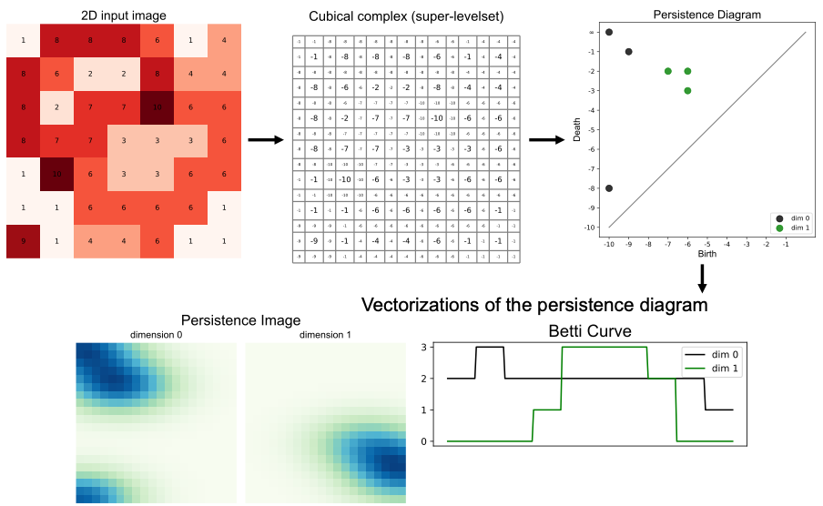
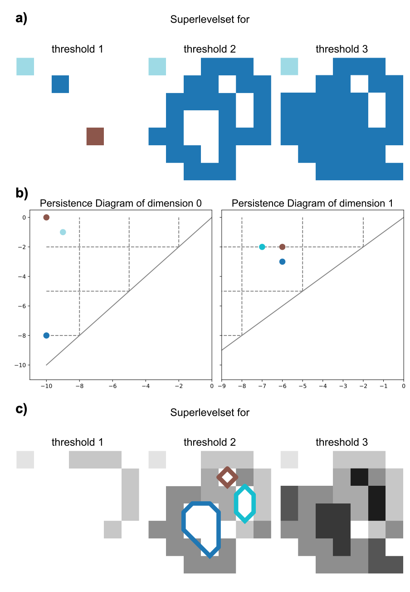
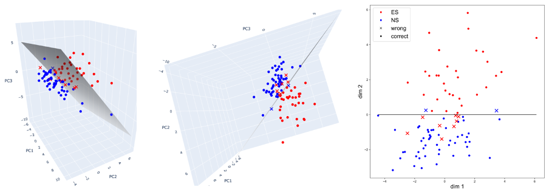

# TDA-Chromatin-Analysis

This repository provides the Topological Data Analysis (TDA) part of the analysis pipeline for the publication (under review) "RNA binding proteins mediate the maturation of chromatin topology during differentiation" by Bondita Dehingia, Małgorzata Milewska-Puchała, Marcin Janowski, Mahmoud-Reza Raifee, Misbah Abbas, Aleksandra Piotrowska, Jan Senge, Piotr Błaut, Dietrich Walsh, Jacqueline Severino, Debadeep Chaudchury, Sajjad Iqbal, Rogelio Montiel-Manriquez, Sylwia Jankowska, Peyman Zare, Wolfgang Huber, Jianliang Xu, Rafael Casellas, Timo Zimmermann, Paweł Dłotko, Jeroen Krijgsveld, Aleksandra Pękowska.

For the analysis we consider embryonic stem (ES) and neural stem (NS) cells from near-super-resolution confocal (Airyscan) and super-resolution (STED) imaging of fixed cells.

## **Background**  

## **Contents**  

Robust tools from Persistent Homology (PH) [1] were employed to analyze the distribution of CTCF in the nuclei of ES/NS cell types. The process as outlined in Table 1, initiates with a three-dimensional stack of grayscale images obtained from an AiryScan or a STED microscope. For the segmentation of the Airyscan images, individual nuclei are segmented independently per slice using the watershed algorithm [2] guided by manually selected markers. Following manual calibration to all segmented images to reduce noise, 5 out of 96 images were excluded due to an absence of clear segmentation between 39 ES and 52 NS cells were obtained for analysis. For the STED images, segmentation can be automated via better resolution and more samples present in the images. Hence, a segmentation utilizing only the projection in 2d along the z-direction and the maximal values can be used, which yields 269 ES and 209 NS cells.

For the image stacks, the elements are called voxels, analogue to pixels in 2d. To minimize differences in the voxel intensities including their distribution and noise on the analysis while using persistent homology, several preprocessing steps are taken: First, the images were clipped such that all values below the 5%-quantile q_5 are mapped to q_5  and all values above the 95%-quantile q_95 are mapped to q_95 to reduce the influence of outliers. The quantiles are computed on the values above the background voxel intensity values. Second, the voxel values are mapped to the [0,1] interval to minimize differences in minima and maxima Third, Gaussian smoothing is performed to further reduce noise within the images using sigma values of 1 in the x- and y-direction, and a larger sigma in the z-direction, corresponding to the larger voxels along that vertical. In the last step of pre-processing, we map the voxel values to [0,1]. 

Following the pre-processing, persistent homology analysis was conducted on the masked and standardized images as demonstrated by the concept in the following:

*Persistence pipeline. We start with an image - in this case, a 2D image - and use its values in the pixels to construct a combinatorial representation called the cubical complex. The persistence diagram then encodes the evolution of “connected components and holes”. Vectorization techniques used in this paper are the persistence image as well as the Betti Curves. Detail for the plot: In this figure, we do a upper-levelset filtration by using a sub-levelset filtration with negative function values. This results in a standard plot for the persistence diagram as points in the upper diagonal. Hence the values in the cubical complex are negative.*

Voxels are added to the image in the descending order of their grayscale levels (voxel intensities) and topological features are recorded  in different dimensions. Specifically, for dimension 0, persistent homology tracks the creation (birth) and merging (death) of connected components. Analogously, a feature of dimension one consists of the time a cycle appears and when it is filled in and two-dimensional features denote voids entirely enclosed by voxels, which cease to exist when filled from within. These collections of birth-death pairs from all zero-, one-, and two-dimensional features constitute the persistence diagrams in corresponding dimensions:

*Example of a filtration of a 2D grayscale image. a) shows the upper-levelsets of three different thresholds. The colors represent the intensity values of the pixels. b) shows the corresponding persistence diagrams in dimension 0 and 1 for this filtration. The dashed lines represent the three threshold values. The dimension 0 points are the connected components we can see in the different thresholds. The diagram for dimension 1 shows persistence pairs corresponding to cycles in the filtration. The colors correspond to the cycles shown in c). c) shows the same filtration as in a) but now we highlight the cycles (the holes) in the images.
The images show how we track features in dimension 0 (connected components) as well as in dimension (holes / cycles) during the evolution of the upper-levelset f^(-1) ([t,∞)) for decreasing values of t or equivalently (-f)^(-1) ((∞,t])) for increasing t. The persistence diagram in dimension 0 shows the connected components which we can see in the first row. For a specific threshold t_i the upper row shows all connected components whose associated persistence pair in the same color are born before or at t_i and die after, i.e. lie left of or on the vertical line at t_i as well as above the horizontal line at t_i. Analogously, the features of dimension 1 are shown in the persistence diagram for dimension 1 and images for three of the thresholds are shown in the third row, highlighting the cycles. Detail for the plot: In this figure, we do a upper-levelset filtration by using a sub-levelset filtration with negative function values. This results in a standard plot for the persistence diagram as  points in the upper- diagonal.*

These three persistence diagrams are used as feature representations of the input image stack and are mapped to corresponding vectors using three primary vectorization techniques: Persistence Images, Betti Curves, and Persistence Statistics.
 
These vectorized diagrams serve as input to Random Forest and Support Vector Machine classifiers to distinguish between ES and NS nuclei. Classification involves a 70/30 training-test split and 5-fold cross-validation, utilizing standard Python library scikit-learn. The average classification performance on the test set is approximately 90%, while on the training set, it is 100%. For detailed information on accuracy, precision, and recall: 

*Perfomance metrics of the classification of the different vectorizations of the persistence diagrams for the ES/NS cells for 90 different 70%-30% train-test set splits.*

In addition to the supervised classification, Principal Component Analysis (PCA) of three principal components was used to reduce the vectorizations from 36 =3*13, 750=3*250, and 1200 = 3*400 parameters for the three dimensions of persistence statistics, Betti Curves and persistence images respectively. After performing PCA, a separating hyperplane was computed using a SVM with a linear kernel. Alternatively put, a plane where (most) of the ES samples lie on one side, while the NS samples lie opposed. For the visualization, the hyperplane was further projected into two dimensions, aligning it with the abscissa axis in this space. By convention, the ES and NS samples should remain on opposite sides of this line. Regarding the explained variance, for the Airyscan and Betti curve vectorizations, PCA retained only 53% of the variance. However, the linear hyperplane achieved an accuracy of 89%, demonstrating that despite some loss of information, the classification remains effective. In contrast, for the STED images and persistence image vectorizations, PCA preserved 99.99% of the variance, and classification via the hyperplane achieved 96% accuracy. To illustrate the projections for Airyscan:

*PCA dimensionality reduction with three principal components of the Betti curve vectorization of Airyscan image stacks (left) together with a separating hyperplane for the ES and NS cells. The space is then aligned such that the hyperplane can be considered a line (middle). A proper projection into 2d space is done along this alignment (right).*

While other dimensionality reduction techniques such as UMAP or tSNE also show clusters for ES and NS cells, they are more sensitive to the chosen parameters and are not deterministic, unlike PCA.

In summary, the performed analysis indicates the existence of stable and measurable differences between CTFC distributions in the ES and NS cells.

## **Usage**  

## **Citation**  
